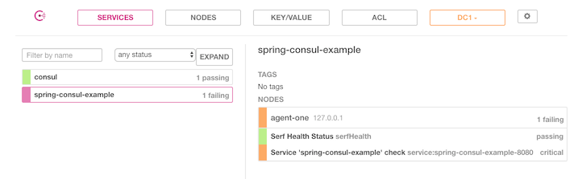
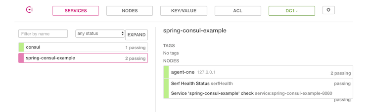
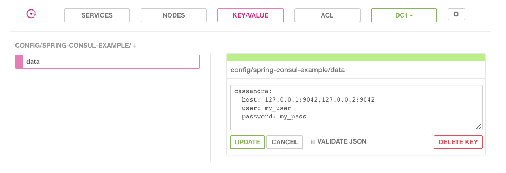

Spring Cloud Consul Client
===========================

### Registration with Consul
A Spring Boot service can register with a Consul Agent by making the following
changes to `bootstrap.yml`,

```yaml
spring:
  cloud:
    consul:
      host: localhost
      port: 8500
```

The above changes can be made in the `application.yml` if your service doesn't
use Spring Cloud configuration functionalities of Consul.

### Health Check
A Consul Agent check the health of a Spring Boot application by using the
`/health` endpoint. 

If the service uses a non-default context path, the changes to the health endpoint
needs to be configured in `application.yml` . For example if the context path
is changed to `foo`, the following changes need to be made:

```yaml
spring:
  cloud:
    consul:
      discovery:
        healthCheckPath: foo/health
        healthCheckInterval: 15s
```

The interval used by Consul to check the health endpoint can also be configured. 

The latest version of Consul (1.0.2) shows a registered Spring Boot application 
to be in critical condition. 



If you check the `/health` endpoint of your application, the consul health
will show up as down:

```json
{
    "consul": {
        "status": "DOWN",
        "services": {
            "consul": [
        
            ],
            "spring-consul-example": [
        
            ]
        },
        "error": "java.lang.IllegalArgumentException: Value must not be null"
    }
}
```

This problem can be mitigated by adding the following snippet in 
`bootstrap.yml`,

```yaml
management:
  security:
    enabled: false
  health:
    consul:
      enabled: false 
```

Once you make the above changes, the service shows up as passing.



### Configuration with Consul
A Spring Boot service can take advantage of Consul's KV store for storing its
configuration properties. The Configurations in Consul KV store are 
usually stored under `/config` folder (data folder and not filse system folder).

For example, the properties of an application named `spring-consul-example`
will be stored under folder,

`config/spring-consul-example/`

The properties of application named `spring-consul-example` and with 
`dev` profile will be stored under folder,

`config/spring-consul-example,dev/`

Proerties in `config/application` is applicable to all applications.

The following changes need to be made to the `bootstrap.yml` to enable 
Consul configuration,

```yaml
spring:
  cloud:
    consul:
      config:
        enabled: true
        prefix: config
        profileSeparator: '::'
```

- Setting `enabled` to `true` enables Consul Config
- `prefix` sets the base folder for configuration values which in this example 
is `config`
- `profileSeparator` sets the value of the separator used to separate the 
profile name in property sources with profiles


#### YAML Configuration
The configuration properties can be stored as a YAML blob with an appropriate 
data key in Consul KV store. For example the properties for the application 
`spring-consul-example` can be stored as JSON blob with `data` as the data key,

```
config/spring-consul-example/data
```

The YAML blob can look something as shown below,

```yaml
cassandra:
  host: 127.0.0.1:9042,127.0.0.2:9042
  user: my_user
  password: my_pass
```

If the data is stored as a YAML blob, following properties need to be set in
the `bootstrap.yml`,

1. `spring.cloud.consul.config.format` to `YAML`
1. `spring.cloud.consul.config.data-key` to `data`

```yaml
spring:
  cloud:
    consul:
      config:
        format: YAML
        data-key: data
```   

The properties can be inserted either manually from the Consul UI or via 
command line. 

#### Entry of Properties from Consul Web UI
To set configuration properties from Consul UI:
- Open the Consul UI page by opening the link, **http://localhost:8500/ui/**, 
in your favorite browser.
- Once the page is open, navigate to KV page by clicking the **KEY/VALUE**
button.
- In the KV page, create a new key by entering `config/spring-consul-example/data`
as the name of the key in text box below **Create Key**.
- Enter a YAML blob or plain string in the text area below and click the
**CREATE** button. This will enter a new set of properties



#### Entry of Properties from Commandline
Consul Agent also provides a command line too to create configuration properties.
- Open a terminal and naviagte to the the directory where the Consul Agent
is located.
- To create a new property named `foo` with a value `bar, you can execute 
the following command:
```
$ ./consul kv put foo bar
```
It will create the new property,
```
Success! Data written to: foo
```

- Once the property is created, you can also access the property from the
command line,
```
$ ./consul kv get foo
bar
``` 

The previously created property from the UI can also be accessed by the 
following command:

```
$ ./consul kv get config/spring-consul-example/data
cassandra:
  host: 127.0.0.1:9042,127.0.0.2:9042
  user: my_user
  password: my_pass
```

You can also load YAMl properties from command line. The YAML data can be read 
from a file by prefixing the file name with the @ symbol.

```
$  ./consul kv put config/application/data @data.yml
Success! Data written to: config/application/data
```

The data can be retrieved the same way, 

```
$ ./consul kv get config/application/data
cassandra:
  host: 127.0.0.1:9042,127.0.0.2:9042
  user: my_user
  password: my_pass
```

### Read Configuration Properties
The configuration is loaded by Spring service during the **bootstrap** phase.
The properties can be read from Consul KV store with the help of `@Value` 
annotation and the stored property name. Here is an example,

```java
@Configuration
@RefreshScope
public class ConsulConfiguration {

    @Value("${cassandra.host}")
    private String cassandraHost;

    @Value("${cassandra.user}")
    private String userName;

    @Value("${cassandra.password}")
    private String password;


    @PostConstruct
    public void postConstruct() {
        System.out.println(
                "********** cassandra.host: " + cassandraHost);
        System.out.println(
                "********** cassandra.user: " + userName);
        System.out.println(
                "********** cassandra.password: " + password);
    }
}
```

Changes to Spring Boot Application class,

```java
@SpringBootApplication
@EnableAutoConfiguration
@EnableConfigurationProperties
@EnableDiscoveryClient
@ComponentScan(basePackages = {"com.basaki"})
public class Application {

    public static void main(String[] args) {
        SpringApplication.run(Application.class, args);
    }
}
```

### Run
To run the client application fromm command line,

```
java -jar target/spring-security-consul-client-1.0.0.jar
```
